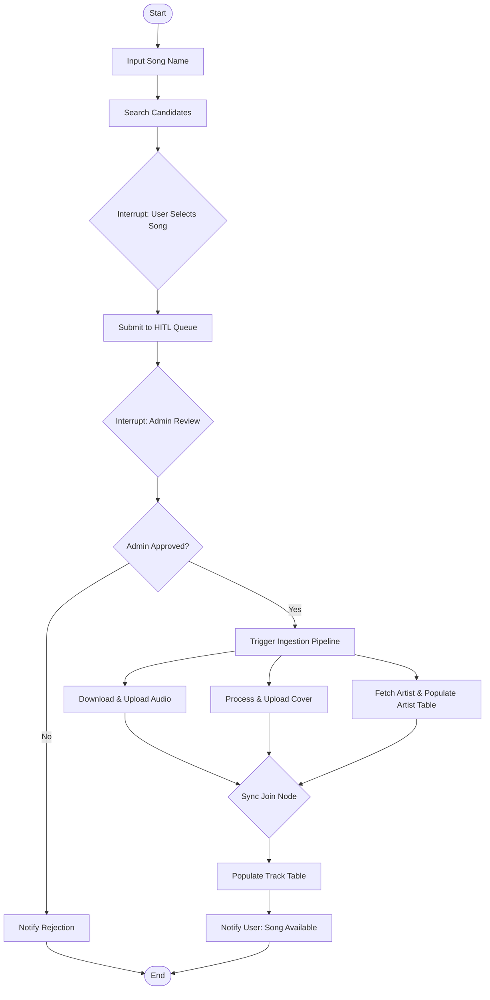

# Agentic AI - Music Ingestion Workflow

This directory contains a complete, self-contained implementation of the music ingestion workflow using LangChain and LangGraph.

## Workflow Architecture

The workflow is modeled as a state machine with the following components:

1. **State (`src/state.py`)**: Stores the data representing the state of the ingestion pipeline.
2. **Nodes (`src/nodes.py`)**: Individual steps of the workflow. Includes an LLM-assisted search using Mistral AI (falling back to a high-fidelity simulator if `MISTRAL_API_KEY` is not present in `.env`).
3. **Graph Topology (`src/graph.py`)**: Coordinates execution, manages parallel ingestion branches, and uses a Memory checkpointer to support Human-in-the-Loop interrupts.
4. **Test Harnesses (`tests/`)**: Contains tests and runners for the workflow.
   - [tests/run.py](file:///e:/ML%20Projects/FastAPI%20Projects/Fermata%20–%20A%20production-ready%20music%20streaming%20backend%20powered%20by%20FastAPI/agentic_ai/tests/run.py): CLI program to simulate executing the graph interactively.
   - [tests/test_flow.py](file:///e:/ML%20Projects/FastAPI%20Projects/Fermata%20–%20A%20production-ready%20music%20streaming%20backend%20powered%20by%20FastAPI/agentic_ai/tests/test_flow.py): Programmatic test suite running both approval/rejection paths.



## Setup & Running the Tests

### 1. Requirements

Ensure you are using the virtual environment:
```bash
# In Windows PowerShell:
.\.venv\Scripts\activate
```

Dependencies required:
- `langgraph`
- `langchain-core`
- `langchain-mistralai`
- `python-dotenv`
- `Pillow`
- `requests`
- `yt-dlp`

### 2. Configure Mistral AI (Optional)

If you want to use the real Mistral AI LLM for searching candidates, add your Mistral API key to the `.env` file in the project root:
```env
MISTRAL_API_KEY=your_mistral_api_key_here
```
If no key is configured, the system automatically falls back to a clean mock search that generates 10 realistic candidates based on your input song name.

### 3. Run the Automated Tests (Recommended)

Run the programmatic test flow for both success/rejection paths by executing:
```bash
python agentic_ai/tests/test_flow.py
```

### 4. Run the Interactive CLI App

Run the interactive terminal app (User and Admin flow) by executing:
```bash
python agentic_ai/tests/run.py
```
