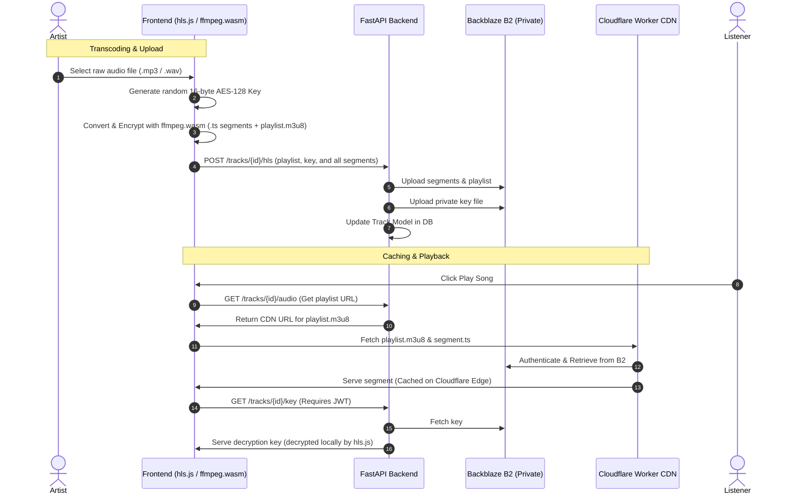

# Encrypted HLS Streaming (HTTP Live Streaming)

This plan details the end-to-end design and implementation steps for **Encrypted HLS Audio Streaming** with client-side transcoding (`ffmpeg.wasm`) and secure backend key delivery.

---

## Architecture Overview



### Key Security Benefits:
* **Anti-Piracy**: The browser player streams 6-second encrypted `.ts` video/audio chunks rather than a single raw `.mp3`. Users cannot easily download the source audio.
* **Backend Security**: The decryption key is served via a JWT-protected FastAPI endpoint. Unauthorized users cannot fetch the key even if they know the playlist URL.
* **Server Cost Savings**: By running the CPU-intensive transcode on the user's browser using WebAssembly, we prevent our Render free-tier hosting from crashing or timing out.

---

## User Review Required

> [!IMPORTANT]
> **ffmpeg.wasm COOP/COEP Headers Constraint**
> Modern browsers restrict shared memory features required by `ffmpeg.wasm` unless two specific headers are returned by the site hosting the frontend:
> 1. `Cross-Origin-Opener-Policy: same-origin`
> 2. `Cross-Origin-Embedder-Policy: require-corp`
> 
> *Solution*: Since your frontend is hosted statically (e.g. GitHub Pages), we will bundle a lightweight helper script called `coi-serviceworker` inside the frontend. This registers a browser service worker that automatically injects these headers client-side, making `ffmpeg.wasm` work on any host without server-level configuration.

---

## Proposed Changes

### Database & Models

#### [NEW] Migration
Generate and run a migration to add these columns to the `tracks` table.

#### [MODIFY] [track.py](file:///e:/ML%20Projects/FastAPI%20Projects/Fermata%20–%20A%20production-ready%20music%20streaming%20backend%20powered%20by%20FastAPI/app/models/track.py)
Add fields for storing the HLS playlist path and key path on B2:
```python
    hls_playlist_key: Mapped[str | None] = mapped_column(String(512), nullable=True)
    hls_key_key: Mapped[str | None] = mapped_column(String(512), nullable=True)
```

---

### Backend API Endpoints

#### [MODIFY] [tracks.py](file:///e:/ML%20Projects/FastAPI%20Projects/Fermata%20–%20A%20production-ready%20music%20streaming%20backend%20powered%20by%20FastAPI/app/routers/tracks.py)
1. **HLS Upload Endpoint**: `POST /tracks/{track_id}/hls`
   * Accepts: `playlist: UploadFile`, `key: UploadFile`, and `segments: list[UploadFile]`.
   * Uploads all `.ts` segments and the `.m3u8` file under `tracks/{track_id}/hls/` prefix in B2.
   * Uploads the encryption key securely under `tracks/{track_id}/hls/encryption.key`.
2. **Secure Key Retrieval Endpoint**: `GET /tracks/{track_id}/key`
   * Requires: User Authentication (`CurrentUser`).
   * Fetches the 16-byte key from B2 and returns it as binary data.

#### [MODIFY] [tracks.py](file:///e:/ML%20Projects/FastAPI%20Projects/Fermata%20–%20A%20production-ready%20music%20streaming%20backend%20powered%20by%20FastAPI/app/services/tracks.py)
* Update `get_track_audio_url` service. If `track.hls_playlist_key` is present:
  * Generate and return the CDN URL pointing to the HLS playlist (e.g. `https://fermata-cdn.fermata-music.workers.dev/tracks/{id}/hls/playlist.m3u8`) instead of the raw `.mp3` URL.

---

### Frontend Testing Client

#### [MODIFY] [index.html](file:///e:/ML%20Projects/FastAPI%20Projects/Fermata%20–%20A%20production-ready%20music%20streaming%20backend%20powered%20by%20FastAPI/frontend/index.html)
1. **Transcoding on Upload**:
   * Add a new section to upload track form: "Enable Encrypted HLS".
   * Integrate `@ffmpeg/ffmpeg` script tags.
   * Write client-side JS to transcode the raw file to HLS with AES-128 encryption using a generated key before uploading.
2. **HLS Playback**:
   * Integrate `hls.js` script tag.
   * Update the audio player logic: If the URL ends with `.m3u8`, initialize `hls.js` and configure the `xhrSetup` callback to inject the user's `Authorization: Bearer <token>` header when requesting key files (`/key`).

---

## Verification Plan

### Automated Tests
* Add unit tests in `tests/test_track_audio.py` verifying:
  * Successful HLS upload endpoint.
  * Access-restricted `/key` endpoint returns 401 for anonymous users and 200 for authenticated users.

### Manual Verification
1. Upload a song with "Encrypted HLS" enabled.
2. Verify in the Backblaze B2 console that the prefix `tracks/{track_id}/hls/` contains the `.m3u8`, `.key`, and `.ts` files.
3. Stream the track using the frontend player. Verify in DevTools that the player retrieves `.ts` files from the Cloudflare CDN, fetches the decryption key from the backend with the `Authorization` header, and plays the audio smoothly.
